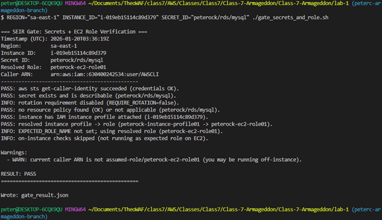
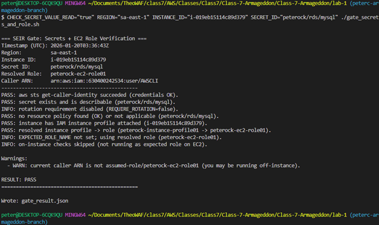
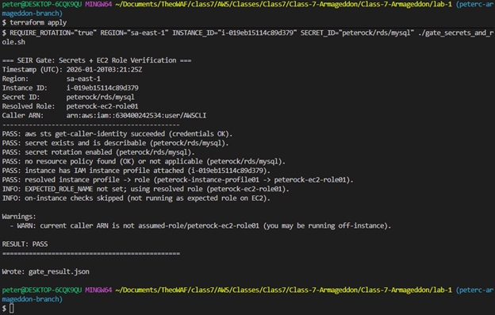
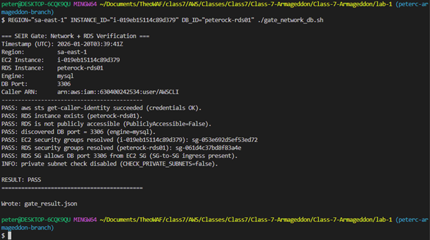
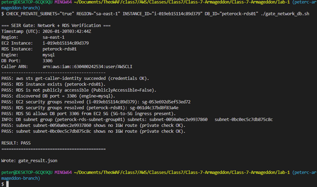
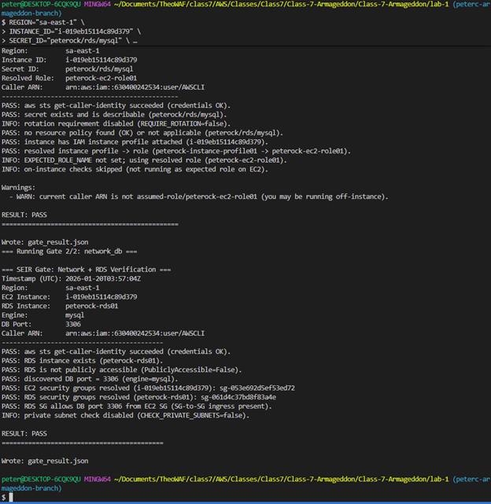
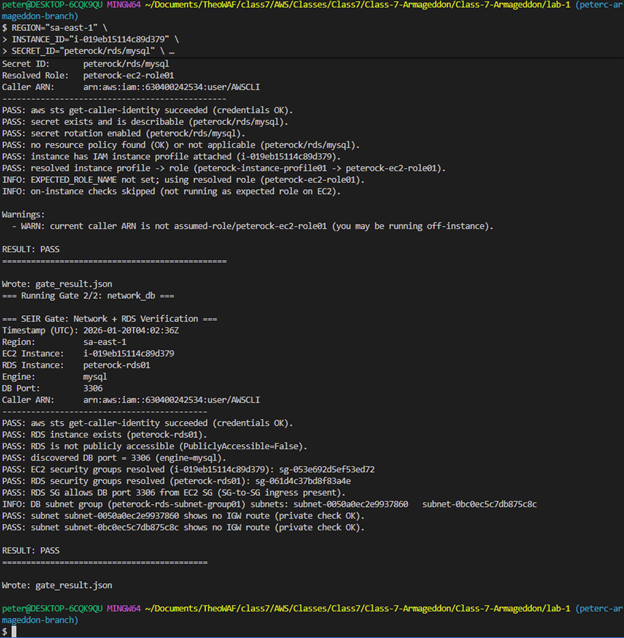
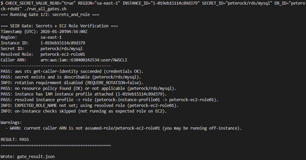
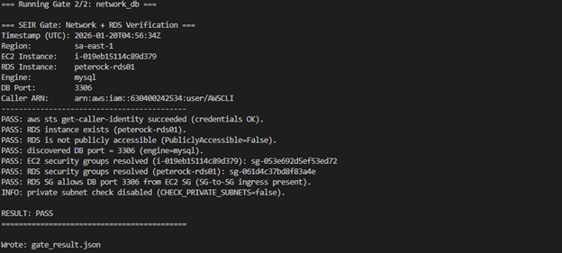
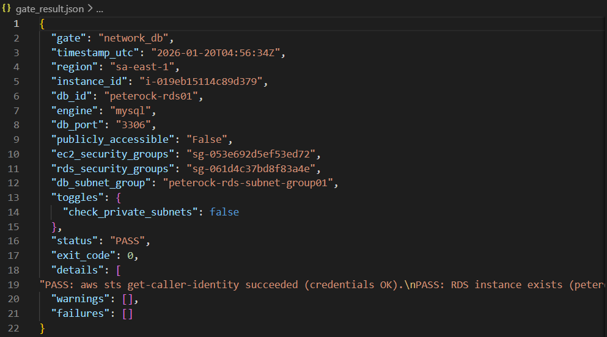

# LAB1-A: Gate Scripts Results

---

## From your workstation (metadata checks; role attach + secret exists)

    chmod +x gate_secrets_and_role.sh
    REGION=us-east-1 INSTANCE_ID=<---> SECRET_ID=<---> ./gate_secrets_and_role.sh

## From inside the EC2 instance (prove the instance role can actually read the secret)

    CHECK_SECRET_VALUE_READ=true REGION=us-east-1 INSTANCE_ID=<---> SECRET_ID=<---> ./gate_secrets_and_role.sh

## Strict mode: require rotation enabled

    REQUIRE_ROTATION=true REGION=us-east-1 INSTANCE_ID=<---> SECRET_ID=<---> ./gate_secrets_and_role.sh

## Basic: verify RDS isn’t public + SG-to-SG rule exists

    chmod +x gate_network_db.sh
    REGION=us-east-1 INSTANCE_ID=<---> DB_ID=<---> ./gate_network_db.sh

## Strict: also verify DB subnets are private (no IGW route)

CHECK_PRIVATE_SUBNETS=true REGION=us-east-1 INSTANCE_ID=i-0123456789abcdef0 DB_ID=mydb01 ./gate_network_db.sh

## If endpoint port discovery fails, override it...

    chmod +x run_all_gates.sh
    REGION=us-east-1 \
    INSTANCE_ID=<---> \
    SECRET_ID=<---> \
    DB_ID=<---> \
    ./run_all_gates.sh
  
  

## Strict options (rotation + private subnet check)

    REQUIRE_ROTATION=true \
    CHECK_PRIVATE_SUBNETS=true \
    REGION=us-east-1 INSTANCE_ID=i-... SECRET_ID=... DB_ID=... \
    ./run_all_gates.sh
  
  

If running ON the EC2 and you want to assert it can read the secret value

    CHECK_SECRET_VALUE_READ=true \
    REGION=us-east-1 INSTANCE_ID=i-... SECRET_ID=... DB_ID=... \
    ./run_all_gates.sh
  
  

## Expected Output:
### Files created:
        gate_secrets_and_role.json
        gate_network_db.json
        gate_result.json ✅ combined summary

