# LAB1-A: Objective & Walkthrough Results

---
## OBJECTIVE:
1. Deploy a simple web app on an EC2 instance that can:
   - Insert a note into RDS MySQL
   - List notes from the database

2. Requirements
   - RDS MySQL instance in a private subnet
   - EC2 instance running a Python Flask app
   - Security groups allowing EC2 → RDS on port 3306
   - Credentials stored in AWS Secrets Manager (recommended)

---
---

# WALKTHROUGH RESULTS
***NOTE: Lab1-A was originally completed in `sa-east-1` instead of us-east-1***
## Part A - SGs & RDS

> ### List all security groups in a region

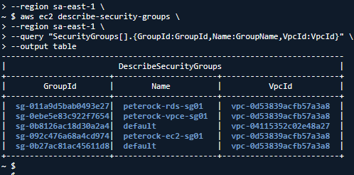

> ### Inspect a specific security group (inbound & outbound rules)

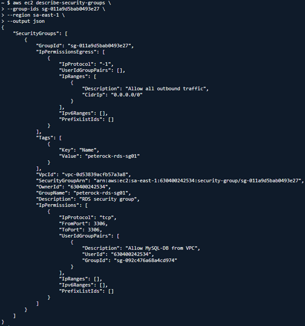

> ### Verify which resources (EC2 instances) are using the security group

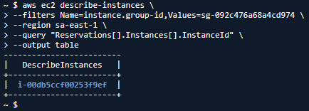

> ### RDS instances

> ### List all RDS instances

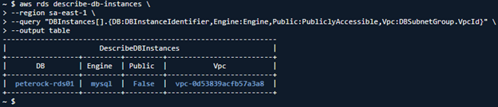

> ### Inspect a specific RDS instance

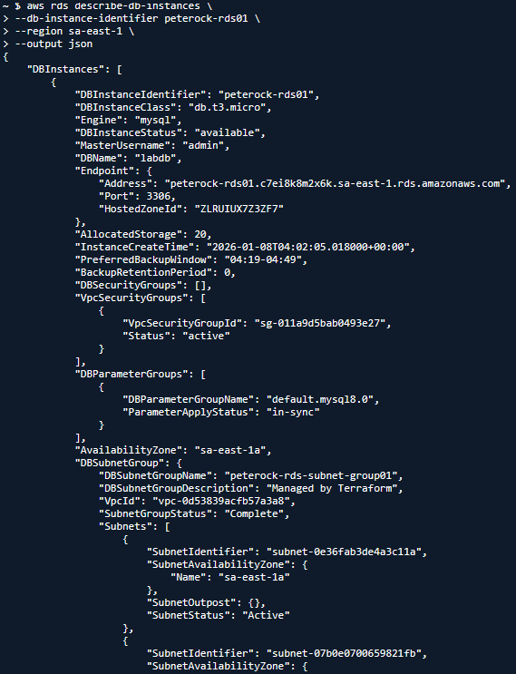
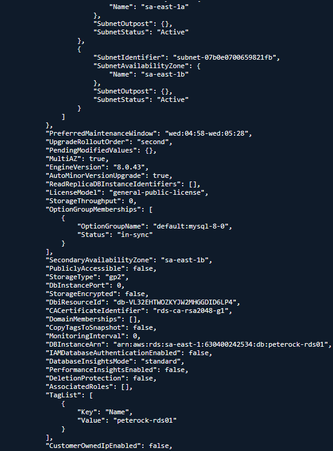
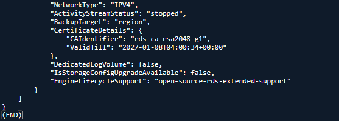

> ### Verify RDS security groups explicitly

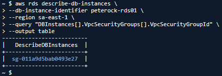

> ### Verify RDS subnet placement

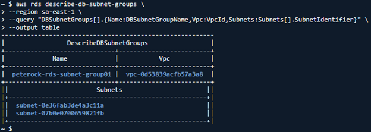

> ### Check if RDS is publicly reachable (quick flag)

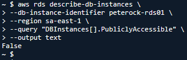

---
---

## Part B — Secret Manager and EC2 IAM Role

> ### Verify Secrets Manager (Existence, Metadata, Access)

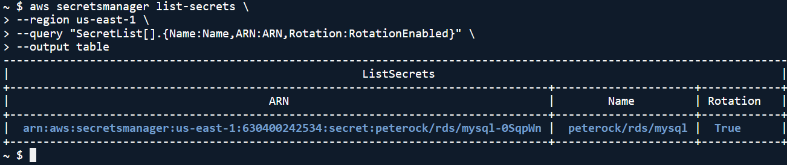

> ### Describe a specific secret (NO value exposure)

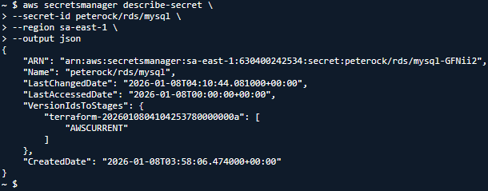

> ### Verify which IAM principals can access the secret

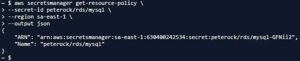

> ### Verify IAM Role Attached to an EC2 Instance
  1. #### Identify the EC2 instance

    aws ec2 describe-instances \
      --filters Name=tag:Name,Values=MyInstance \
      --region us-east-1 \
      --query "Reservations[].Instances[].InstanceId" \
      --output text

  2. #### Check the IAM role attached to the instance

  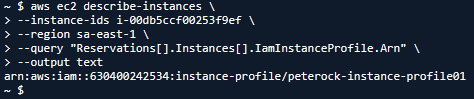
  
  3. ##### Resolve instance profile → role name

  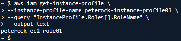

> ### Verify IAM Role Permissions (Critical): List policies attached to the role

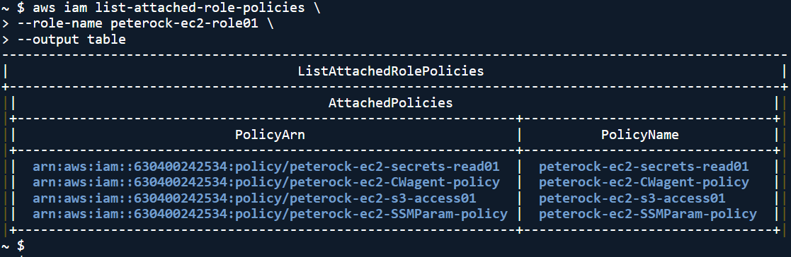

> ### List inline policies (often forgotten)

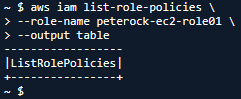

> ### Inspect a specific managed policy

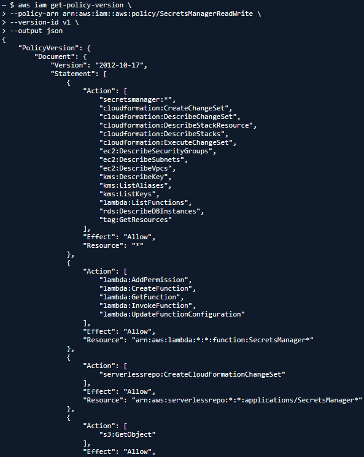
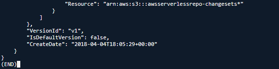

What you’re verifying
    Least privilege
    Only secretsmanager:GetSecretValue if read-only
    No wildcard * unless justified

---
---

## Part C — EC2 → RDS Testing
> ### http://<EC2_PUBLIC_IP>/init

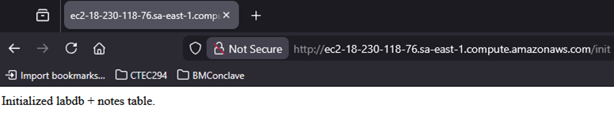

> ### http://<EC2_PUBLIC_IP>/add?note=

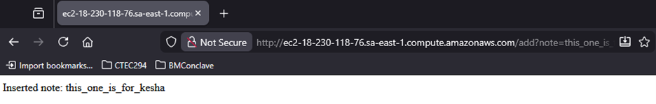

> ### http://<EC2_PUBLIC_IP>/list

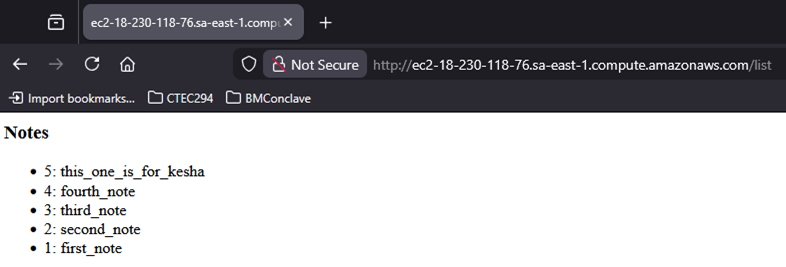

> ### Verify EC2 → RDS access path (security-group–to–security-group)

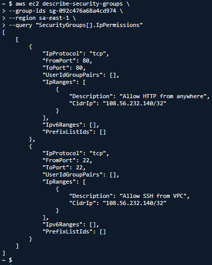

> ### Verify That EC2 Can Actually Read the Secret (From the Instance); From inside the EC2 instance:

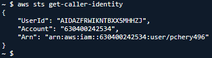

Expected:Arn: arn:aws:sts::123456789012:assumed-role/MyEC2Role/i-0123456789abcdef0

> ### Then test access:

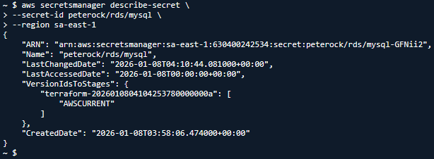

If this works:
    IAM role is correctly attached
    Permissions are effective

---
---

## Part D - Student Deliverables
> ### Screenshot of:
  #### 1. RDS SG inbound rule using source = sg-ec2-lab
  
  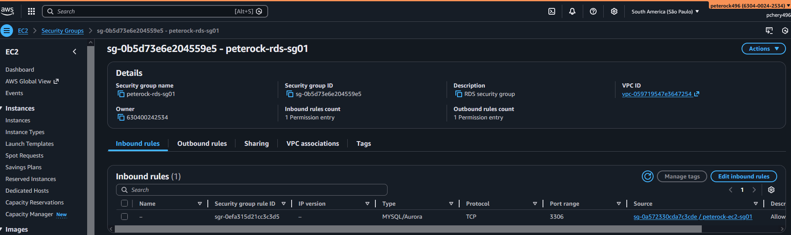

  #### 2. EC2 Role 
  
  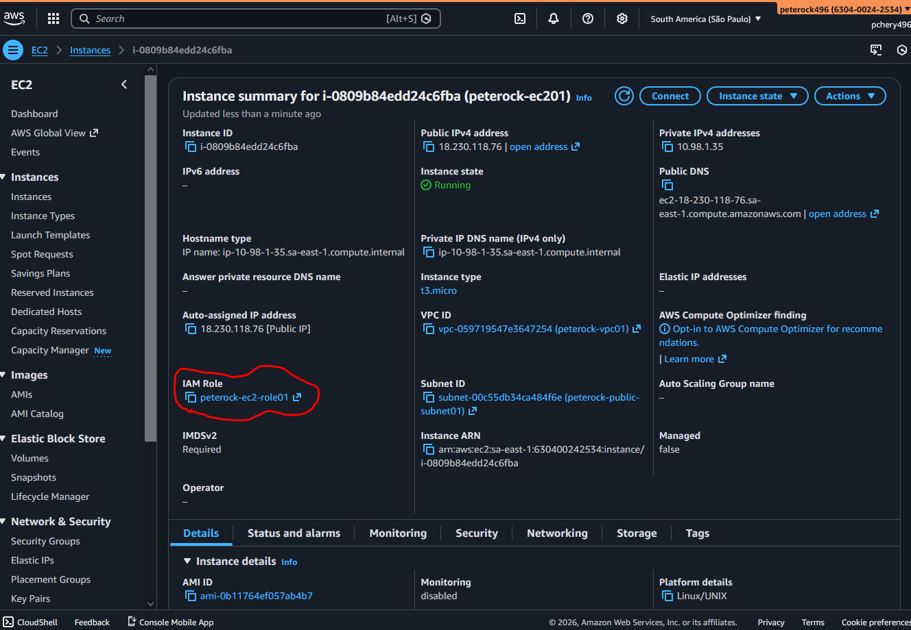

  #### 3. /list output showing at least 3 notes

  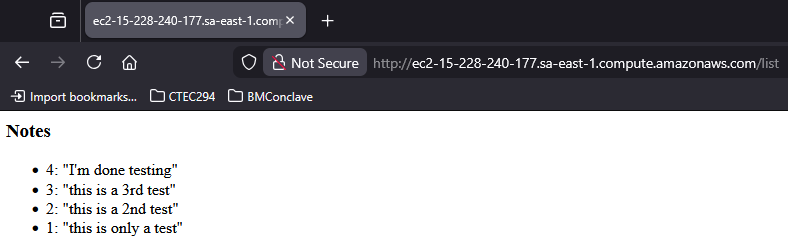

> ### Short answers:
  #### 1. Why is DB inbound source restricted to the EC2 security group?
          - 
  #### 2. What port does MySQL use?
          - 
  #### 3. Why is Secrets Manager better than storing creds in code/user-data?
          - 

3) Evidence for Audits / Labs (Recommended Output)

      aws ec2 describe-security-groups --group-ids sg-0123456789abcdef0 > sg.json
      aws rds describe-db-instances --db-instance-identifier mydb01 > rds.json
      aws secretsmanager describe-secret --secret-id my-db-secret > secret.json
      aws ec2 describe-instances --instance-ids i-0123456789abcdef0 > instance.json
      aws iam list-attached-role-policies --role-name MyEC2Role > role-policies.json

Then Answer:
    Why each rule exists
    What would break if removed
    Why broader access is forbidden
    Why this role exists
    Why it can read this secret
    Why it cannot read others

