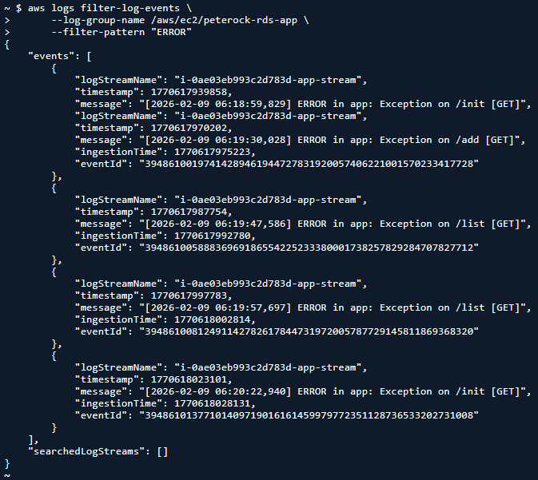
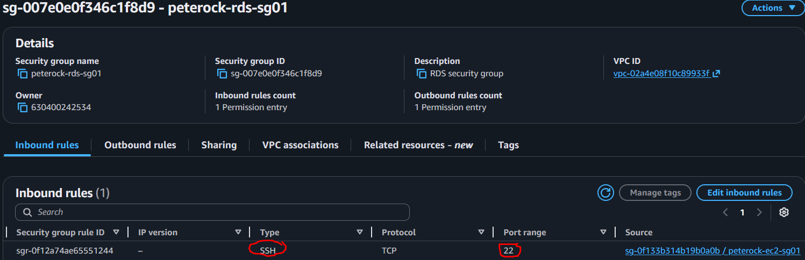
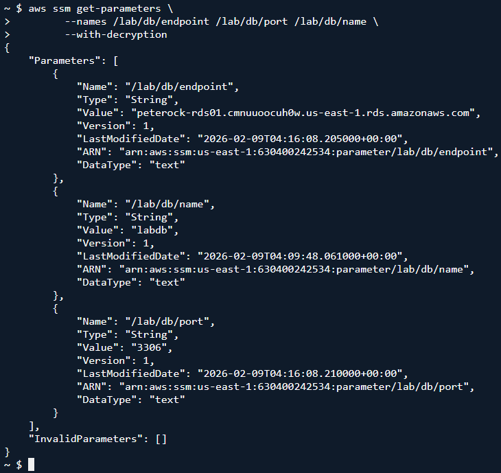
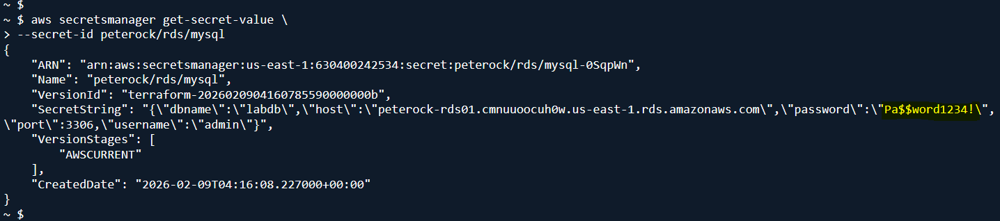
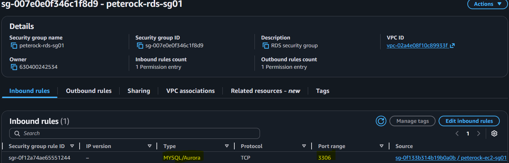
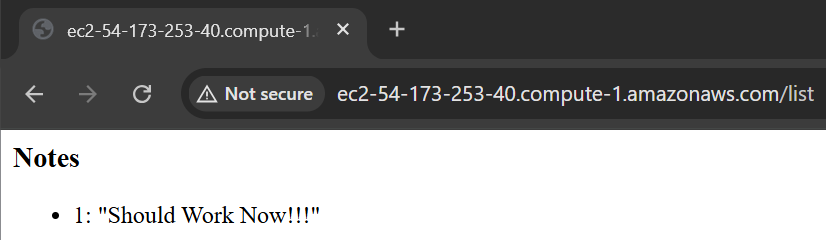

# LAB1-B INCIDENT RESPONSE RUNBOOK
---

## RUNBOOK SECTION 2 — Observe

### 2.1 Check Application Logs

      aws logs filter-log-events \
      --log-group-name /aws/ec2/peterock-rds-app \
      --filter-pattern "ERROR"

  

### 2.2 Identify Failure Type
  #### [Note: SNS Email Notification](./artifacts/lab1b/Gmail%20-%20ALARM_peterock-db-connection-failure_%20in%20US%20East%20(N.%20Virginia).pdf)

      Failure was due to Network Failure: RDS SG misconfigured with wrong ingress port #

  

---

## RUNBOOK SECTION 3 — Validate Configuration Sources

### 3.1 Retrieve Parameter Store Values
    
      aws ssm get-parameters \
        --names /lab/db/endpoint /lab/db/port /lab/db/name \
        --with-decryption

  

### 3.2 Retrieve Secrets Manager Values

      aws secretsmanager get-secret-value \
      --secret-id lab/rds/mysql

***Note: Password similar to good state***

  

---

## RUNBOOK SECTION 4 — Containment

### 4.1 Prevent Further Damage
      “System state preserved for recovery.”

---

## RUNBOOK SECTION 5 — Containment

### 5.1 Bonus A: Prove CloudWatch logs delivery path is available via endpoint
      If Network Block
        Restore EC2 security group access to RDS on 3306

  

      Verify Recovery
          curl http://<EC2_PUBLIC_IP>/
          
  

## RUNBOOK SECTION 6 — Post-Incident Validation

### 6.1 Confirm Alarm Clears

    aws cloudwatch describe-alarms \
      --alarm-name lab-db-connection-failure \
      --query "MetricAlarms[].StateValue"

### 6.2 Confirm Logs Normalize

    aws logs filter-log-events \
      --log-group-name /aws/ec2/lab-rds-app \
      --filter-pattern "ERROR"

PART V — Grading Rubric (100 Points)
| Category                       | Points |
| ------------------------------ | ------ |
| Alarm acknowledged via CLI     | 10     |
| Correct failure classification | 20     |
| Logs used correctly            | 15     |
| Parameter Store validated      | 10     |
| Secrets Manager validated      | 10     |
| Correct recovery action        | 20     |
| No redeploy / no guesswork     | 10     |
| Clear incident summary         | 5      |

PART VI — Required Incident Report (Short)
Students must submit:
    Incident Summary
    What failed?
    How was it detected?
    Root cause
    Time to recovery

Preventive Action
    One improvement to reduce MTTR
    One improvement to prevent recurrence

