# LAB1-C BONUS A RESULTS

## 1. Bonus A: Prove EC2 is private (no public IP)
  aws ec2 describe-instances \
  --instance-ids <INSTANCE_ID> \
  --query "Reservations[].Instances[].PublicIpAddress"

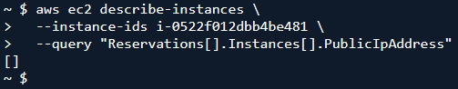

## 2. Bonus A: Prove VPC endpoints exist
  aws ec2 describe-vpc-endpoints \
  --filters "Name=vpc-id,Values=<VPC_ID>" \
  --query "VpcEndpoints[].ServiceName"

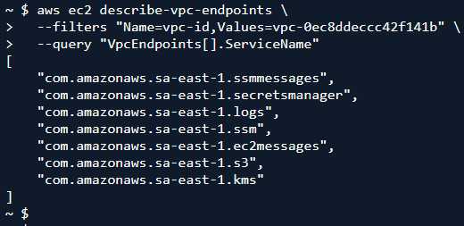

## 3. Bonus A: Prove Session Manager path works (no SSH)
  aws ssm describe-instance-information \
  --query "InstanceInformationList[].InstanceId"

Expected: your private EC2 instance ID appears

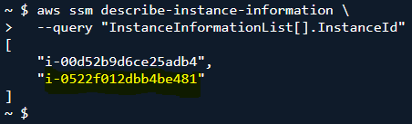

## 4. Bonus A: Prove the instance can read both config stores
Run from SSM session:
  aws ssm get-parameter --name <ssm-param-name>
  aws secretsmanager get-secret-value --secret-id <your-secret-name>

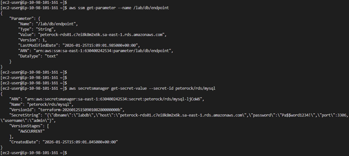

## 5. Bonus A: Prove CloudWatch logs delivery path is available via endpoint
  aws logs describe-log-streams \
    --log-group-name /aws/ec2/<prefix>-rds-app

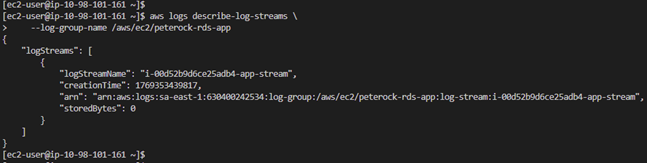

---
---

# LAB1-C BONUS B RESULTS

## 1. Bonus B: ALB exists and is activ
  aws elbv2 describe-load-balancers \
  --names chewbacca-alb01 \
  --query "LoadBalancers[0].State.Code"

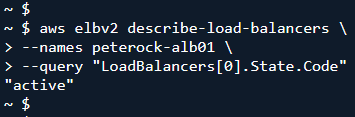

## 2. Bonus B: HTTPS listener exists on 443
  aws elbv2 describe-listeners \
  --load-balancer-arn <ALB_ARN> \
  --query "Listeners[].Port"

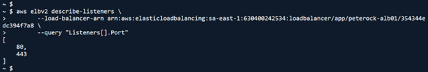

## 3. Bonus B: Target is healthy
  aws elbv2 describe-target-health \
    --target-group-arn <TG_ARN>

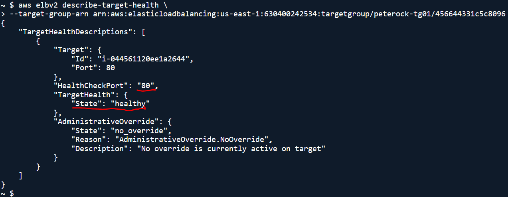

## 4. Bonus B: WAF attached
Run from SSM session:
  aws wafv2 get-web-acl-for-resource \
  --resource-arn <ALB_ARN>

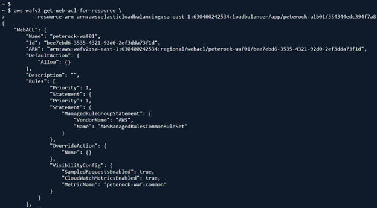
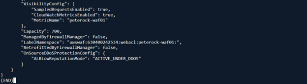

## 5. Bonus B: Alarm created (ALB 5xx)
  aws cloudwatch describe-alarms \
  --alarm-name-prefix chewbacca-alb-5xx

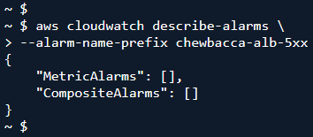

## 6. Bonus B: Dashboard exists
  aws cloudwatch list-dashboards \
        --dashboard-name-prefix chewbacca

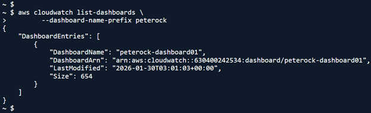

---
---

# LAB1-C BONUS C RESULTS

## 1. Bonus C: Confirm hosted zone exists (if managed)
  aws route53 list-hosted-zones-by-name \
    --dns-name chewbacca-growl.com \
    --query "HostedZones[].Id"

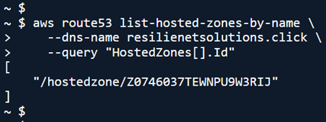

## 2. Bonus C: Confirm app record exists
  aws route53 list-resource-record-sets \
  --hosted-zone-id <ZONE_ID> \
  --query "ResourceRecordSets[?Name=='app.resilienetsolutions.click.']"

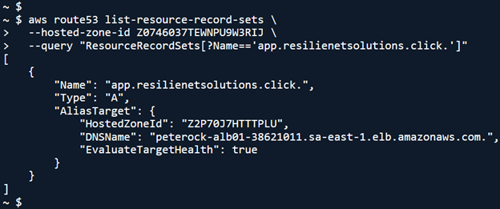

## 3. Bonus C: Confirm certificate issued
  aws acm describe-certificate \
  --certificate-arn <CERT_ARN> \
  --query "Certificate.Status"

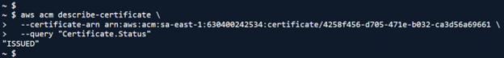

## 4. Bonus C: Confirm HTTPS works
  curl -I https://app.resilienetsolutions.click

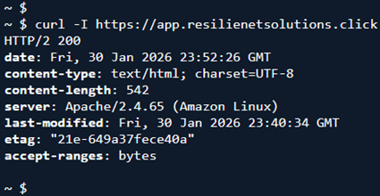
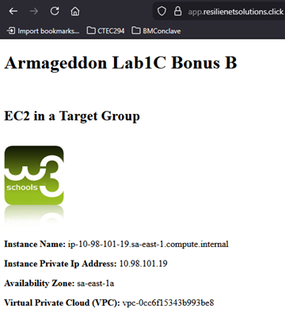

---
---

# LAB1-C BONUS D RESULTS

## 1. Bonus D: Verify apex record exists
  aws route53 list-resource-record-sets \
    --hosted-zone-id <ZONE_ID> \
    --query "ResourceRecordSets[?Name=='chewbacca-growl.com.']"

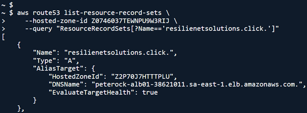
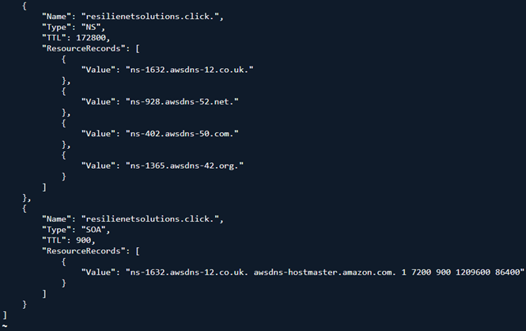

## 2. Bonus D: Verify ALB logging is enabled
  aws elbv2 describe-load-balancers \
    --names chewbacca-alb01 \
    --query "LoadBalancers[0].LoadBalancerArn"
  
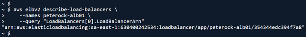

  aws elbv2 describe-load-balancer-attributes \
    --load-balancer-arn <ALB_ARN>
  
  Expected attributes include: \
  - access_logs.s3.enabled = true \
  - access_logs.s3.bucket = your bucket \
  - access_logs.s3.prefix = your prefix

  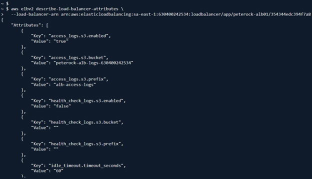
  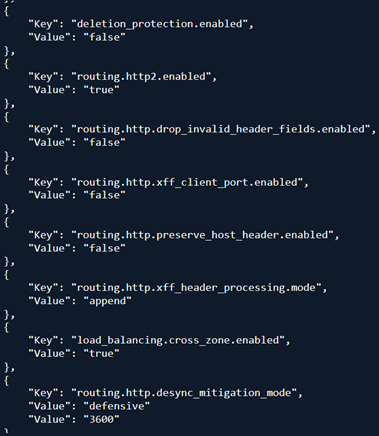
  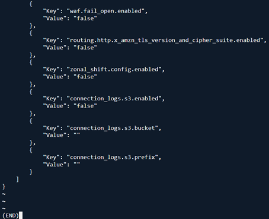

## 3. Bonus D: Generate some traffic
  curl -I https://resilienetsolutions.click \
  curl -I https://app.resilienetsolutions.click

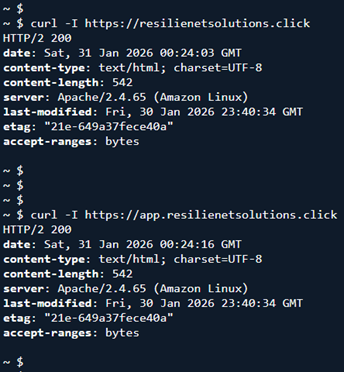

## 4. Bonus D: Verify logs arrived in S3 (may take a few minutes)
  aws s3 ls s3://<BUCKET_NAME>/<PREFIX>/AWSLogs/<ACCOUNT_ID>/elasticloadbalancing/ --recursive | head

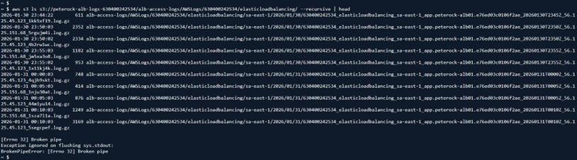

---
---

# LAB1-C BONUS E RESULTS

## 1. Bonus E: Confirm WAF logging is enabled (authoritative)
  aws wafv2 get-logging-configuration \
    --resource-arn <WEB_ACL_ARN>

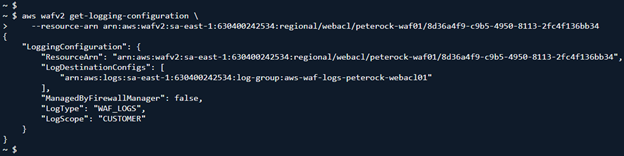

## 2. Bonus E: Generate traffic (hits + blocks)
  curl -I https://resilienetsolutions.click \
  curl -I https://app.resilienetsolutions.click
  
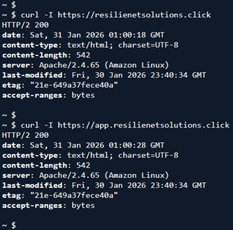

## 3. Bonus E: If CloudWatch Logs destination
  aws logs describe-log-streams \
  --log-group-name aws-waf-logs-<project>-webacl01 \
  --order-by LastEventTime --descending
  
  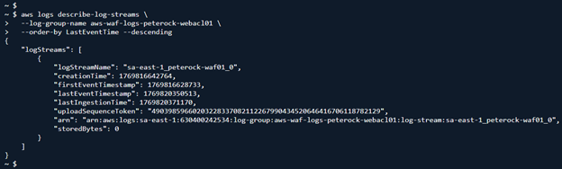

  Then pull recent events:

  aws logs filter-log-events \
  --log-group-name aws-waf-logs-<project>-webacl01 \
  --max-items 20
  
  [WAFF-Log-Events-Sample](./artifacts/lab1c/WAF-Events-013026.txt)

---
---

