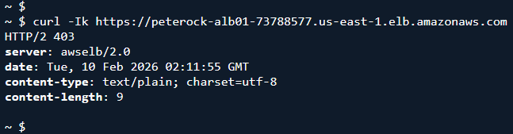
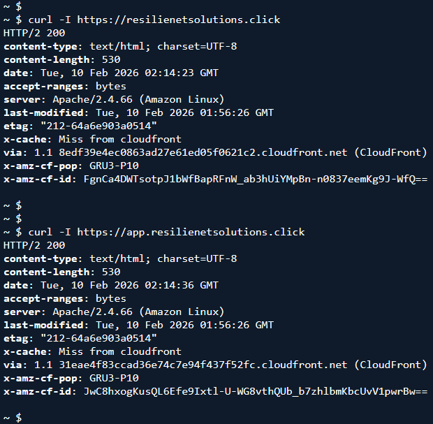
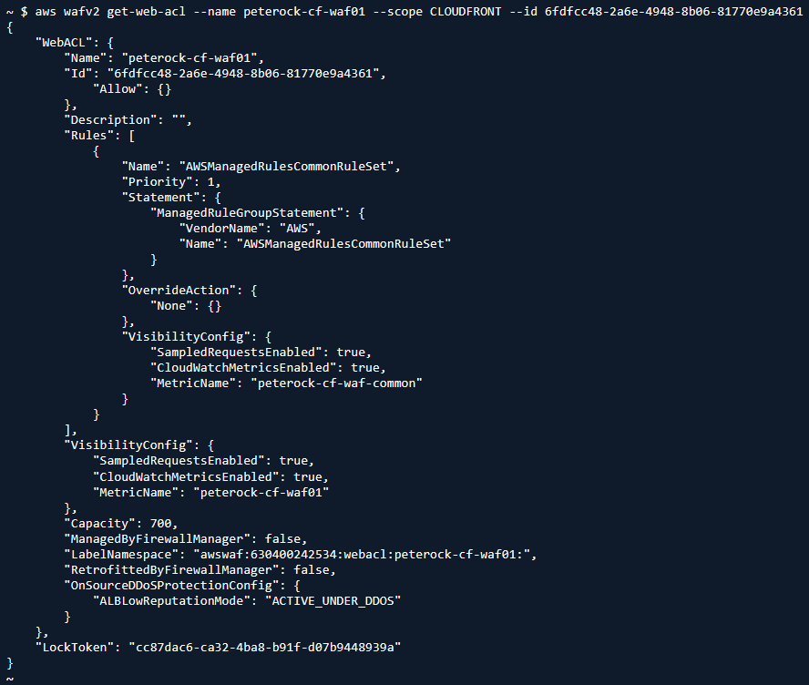
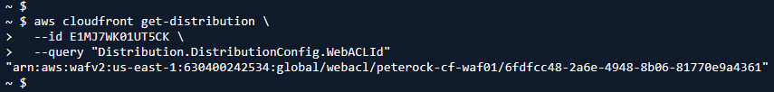
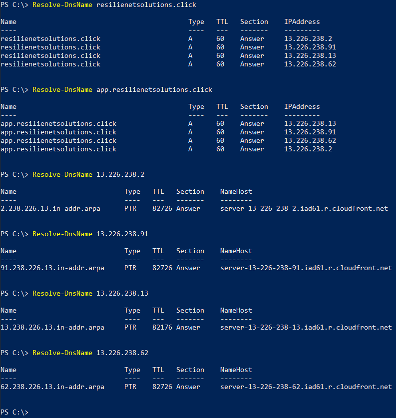

# LAB2-A: RESULTS

---

## 1. “VPC is only reachable via CloudFront”

### Direct ALB access should fail (403)
  curl -I https://<ALB_DNS_NAME>

### CloudFront access should succeed
  curl -I https://chewbacca-growl.com
  curl -I https://app.chewbacca-growl.com

## 2. WAF moved to CloudFront

  aws wafv2 get-web-acl \
  --name <project>-cf-waf01 \
  --scope CLOUDFRONT \
  --id <WEB_ACL_ID>

### And confirm distribution references it:
  aws cloudfront get-distribution \
  --id <DISTRIBUTION_ID> \
  --query "Distribution.DistributionConfig.WebACLId"

## 3. resilienetsolutions.click points to CloudFront

  dig chewbacca-growl.com A +short
  dig app.chewbacca-growl.com A +short

